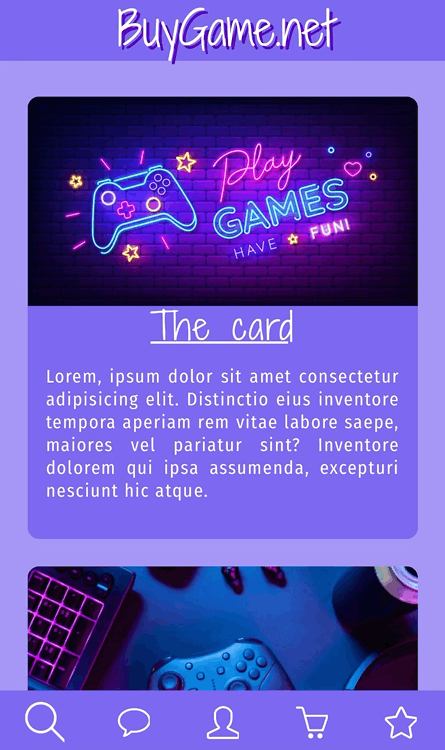

<h1> React Demo </h1>
<p>
The application is demonstration of React 18 features. It's set of complex components.
Realized components:
<ul>
   <li>Top Navigation Bar</li>
   <li>Side Navigation Bar</li>
   <li>Carousel</li>
   <li>Set of cards</li>
</ul>
</p>

__[Please, look how it works here! :)](https://frontdev98.github.io/React-18/)__

<h2>Requirements</h2>
<ul>
  <li>NodeJS 22.12.0</li>
</ul>

<h2>Features</h2
The application 

<h2>Launch</h2>

```bash
# 1. Download the source code and go to the folder
git clone https://github.com/frontdev98/React-demo.git

# 2. Go to the project's directory
cd React-demo
```

```bash
# 2. Launch the project in dev mode
export BROWSER=${browser-name} && npm run dev -- --host 0.0.0.0 --port 8080
```

<h2>Build for production</h2>

```bash
npm run build
```

<h2> Desktop </h2>  
<p>The layout gets activation when screen size is larger than 768 pixels.</p>
Tested in next browsers:
<ul>
  <li>Chrome 129.0.6668.70</li>
  <li>Firefox 133.0 </li>
</ul>


<h2> Mobile Layout </h2>
<p> The layout gets activation when screen width smaller than 768 pixels.</p>
Tested in next browsers:
<ul>
  <li>Safari 18.2</li>
  <li>Chrome 132.0.6834.100</li>
</ul>
<div>
  
  
</div>
